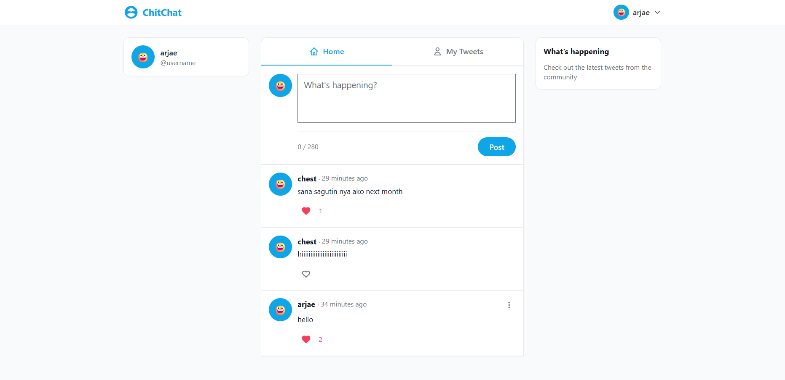
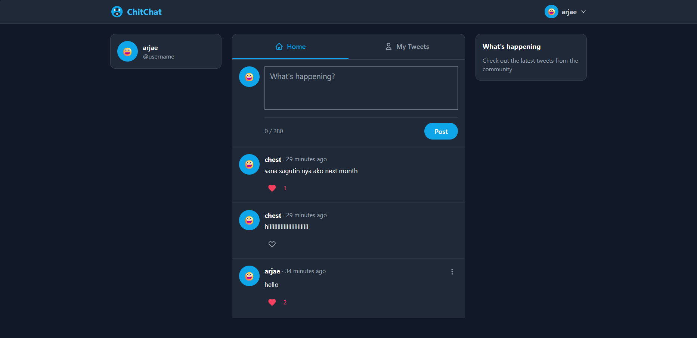
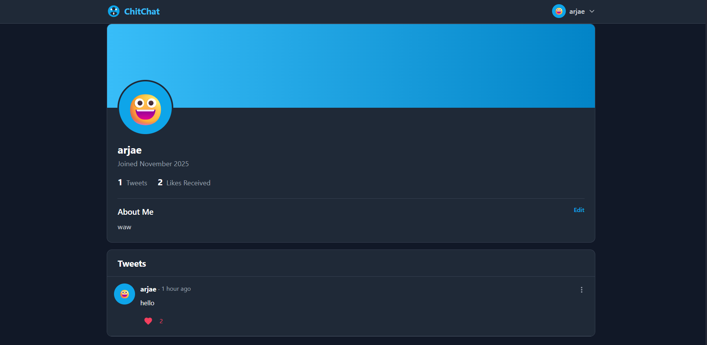
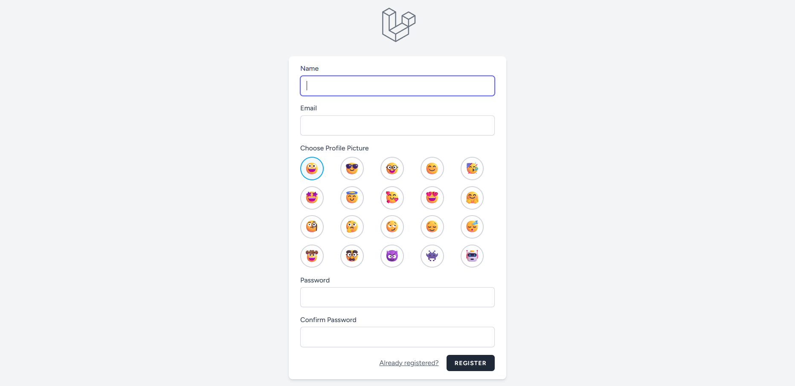
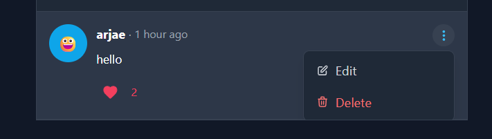
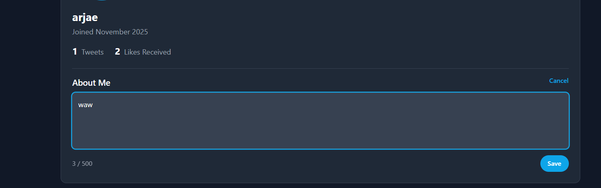
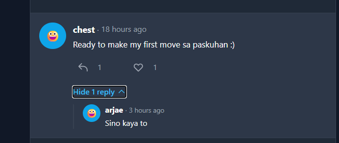

# ChitChat - A Twitter-Like Social Media Platform

ChitChat is a modern social media web application inspired by Twitter, built with Laravel and Tailwind CSS. It provides users with a clean, intuitive interface to share thoughts, interact with others, and build their online presence.

## 📋 Project Description

ChitChat is a full-featured microblogging platform that allows users to:
- Share short messages (tweets) up to 280 characters
- Like and interact with other users' posts
- Edit and delete their own tweets
- Customize their profile with emoji avatars and About Me sections
- Toggle between light and dark themes
- View personalized feeds and individual user profiles

This project was developed as a midterm examination project for a Laravel course, demonstrating proficiency in modern web development practices, MVC architecture, and responsive design.

## ✨ Features Implemented

### User Authentication
- **User Registration** - Create new accounts with email verification
- **Login/Logout** - Secure authentication system using Laravel Breeze
- **Profile Picture Selection** - Choose from 20 unique emoji avatars during registration

### Tweet Management
- **Create Tweets** - Post messages up to 280 characters with real-time character counter
- **Edit Tweets** - Modify your own tweets with inline editing
- **Delete Tweets** - Remove unwanted posts with confirmation dialog
- **Tweet Timestamps** - Display relative time (e.g., "2 hours ago") with edited indicators

### Social Interactions
- **Like System** - Live like/unlike functionality without page refresh
- **Real-time Like Counter** - Instant updates using AJAX
- **User Profiles** - View any user's profile with their tweets and stats
- **Profile Stats** - Display total tweets and total likes received

### User Profiles
- **Profile Page** - Dedicated page showing user information and tweet history
- **Editable About Me** - 500-character biography section with character counter
- **Clickable Usernames** - Navigate to user profiles from any tweet
- **Profile Stats Dashboard** - View tweet count and engagement metrics

### UI/UX Features
- **Dark/Light Mode** - Toggle theme with persistent localStorage
- **Responsive Design** - Mobile-friendly three-column layout (sidebar, feed, trending)
- **Twitter-Inspired UI** - Classic sky-blue color scheme (#0EA5E9)
- **Custom Branding** - ChitChat logo and personalized design elements
- **Smooth Animations** - Hover effects and transitions for better UX
- **Tab Navigation** - Switch between "Home" (all tweets) and "My Tweets" (personal feed)

### Additional Features
- **Avatar System** - Reusable avatar component with 4 size variants (sm, md, lg, xl)
- **Dropdown Menus** - Alpine.js-powered interactive menus
- **Form Validation** - Server-side and client-side input validation
- **Error Handling** - User-friendly error messages and alerts
- **CSRF Protection** - Built-in Laravel security features
- **Reply to Tweets** - Click the reply button on any tweet

### Prerequisites
- PHP >= 8.2
- Composer
- Node.js and npm
- MySQL/MariaDB database server for local server
- Git 
- MySQL8 for database cloud storage

### Step 1: Clone the Repository
```bash
git clone https://github.com/real-name-hidden-bit/chitchat.git
cd chitchat
```

Or download the ZIP file and extract it to your local machine.

### Step 2: Install PHP Dependencies
```bash
composer install
```

### Step 3: Install JavaScript Dependencies
```bash
npm install
```

### Step 4: Environment Configuration
1. Copy the example environment file:
```bash
cp .env
```

2. Generate application key:
```bash
php artisan key:generate
```

3. Edit the `.env` file and configure your database connection:
```env
DB_CONNECTION=mysql
DB_HOST=127.0.0.1
DB_PORT=3306
DB_DATABASE=chitchat
DB_USERNAME=your_database_username
DB_PASSWORD=your_database_password
```

### Step 5: Build Frontend Assets
```bash
npm run build
```

For development with hot reload:
```bash
npm run dev
```

## 🗄️ Database Setup

### Step 1: Create Database
Create a new MySQL database named `chitchat` using phpMyAdmin or command line:

**Using Database locally:**
1. Open phpMyAdmin in your b    rowser (usually `http://localhost/phpmyadmin`)
2. Click "New" in the left sidebar
3. Enter `chitchat` as the database name
4. Select `utf8mb4_unicode_ci` as collation
5. Click "Create"

**Using Dataabase in Laravel Cloud:**
1. Open project dashboard in Laravel Cloud
2. Click on the "Resources" or "Databases" tab in the navigation menu
3. Click the "New Database" button
4. Configure the database details:
    Name: Enter chitchat (or your preferred name)
    Type: Select MySQL (or PostgreSQL if preferred)
    Version: I Choose the latest stable version (8.0 for MySQL)
5. Click "Create"

**Using Command Line:**
```bash
mysql -u root -p
CREATE DATABASE chitchat CHARACTER SET utf8mb4 COLLATE utf8mb4_unicode_ci;
exit;
```

### Step 2: Run Migrations
Execute the database migrations to create all necessary tables:
```bash
php artisan migrate
```

This will create the following tables:
- `users` - User accounts with profile pictures and about me sections
- `tweets` - User posts/tweets
- `likes` - Many-to-many relationship between users and tweets
- `cache` - Application caching
- `jobs` - Queue system
- `password_reset_tokens` - Password reset functionality
- `sessions` - User session management

### Database Schema Overview

**Users Table:**
- id, name, email, password
- profile_picture (emoji avatar)
- about_me (biography, max 500 chars)
- email_verified_at, timestamps

**Tweets Table:**
- id, user_id (foreign key)
- content (max 280 chars)
- created_at, updated_at

**Likes Table:**
- tweet_id (foreign key)
- user_id (foreign key)
- created_at

## 🚀 Running the Application

### Step 1: Start the Development Server
```bash
php artisan serve
```

The application will be available at `http://localhost:8000`


### Step 2: Access the Application
Open your browser and navigate to:
```
https://chitchat-main-ga5iuo.laravel.cloud
```

## 📸 Screenshots

### Homepage/Feed

*Main feed showing tweets from all users with the compose box at the top*


### Dark Mode

*Dark theme toggle with persistent preference across sessions*

### User Profile

*User profile displaying avatar, stats, About Me section, and personal tweets*

### Registration with Avatar Selection

*Sign-up page with 20 emoji profile picture options*

### Tweet Interactions

*Like button with live counter and edit/delete options for own tweets*

### About Me Section

*Editable biography section with 500-character limit and counter*

### Reply Section



##  Project Structure

```
ChitChat/
├── app/
│   ├── Http/
│   │   └── Controllers/
│   │       ├── Auth/
│   │       │   ├── AuthenticatedSessionController.php
│   │       │   └── RegisteredUserController.php
│   │       ├── ProfileController.php
│   │       └── TweetController.php
│   └── Models/
│       ├── Tweet.php
│       └── User.php
├── database/
│   └── migrations/
│       ├── 0001_01_01_000000_create_users_table.php
│       ├── 0001_01_01_000001_create_cache_table.php
│       ├── 0001_01_01_000002_create_jobs_table.php
│       ├── 0001_01_01_000002_create_tweets_table.php
│       └── 2025_11_25_030641_add_parent_id_to_tweets_table.php  
├── resources/
│   ├── css/
│   │   └── app.css
│   ├── js/
│   │   ├── app.js
│   │   └── bootstrap.js
│   └── views/
│       ├── auth/
│       │   ├── login.blade.php
│       │   └── register.blade.php
│       ├── components/
│       │   ├── tweet-card.blade.php
│       │   └── user-avatar.blade.php
│       ├── profile/
│       │   └── show.blade.php
│       └── welcome.blade.php
├── routes/
│   ├── auth.php
│   └── web.php
├── tailwind.config.js
├── vite.config.js
├── composer.json
├── package.json
└── README.md
```

## 🔧 Technologies Used

- **Backend:** Laravel 12.39.0 (PHP 8.3.14)
- **Frontend:** Blade Templates, Tailwind CSS, Alpine.js
- **Database:** MySQL 8.0+
- **Build Tool:** Vite
- **Authentication:** Laravel Breeze
- **Icons:** Heroicons (SVG)

## 📝 Usage Guide

### Creating a Tweet
1. Log in to your account
2. Type your message in the "What's happening?" box (max 280 characters)
3. Click the "Post" button
4. Your tweet appears at the top of the feed

### Liking a Tweet
1. Click the heart icon on any tweet
2. The counter updates instantly without page reload
3. Click again to unlike

### Editing Your Profile
1. Click on your profile picture in the top-right corner
2. Select "Profile" from the dropdown
3. Click "Edit About Me"
4. Enter your biography (max 500 characters)
5. Click "Save"

### Switching Themes
1. Click your profile picture in the navigation
2. Click the theme toggle button
3. The theme persists across sessions

## 🤝 Credits

This project was developed with assistance from **Gemini Pro 3.0** by Google, which provided guidance on:
- Laravel best practices and architecture
- Tailwind CSS styling and responsive design
- JavaScript AJAX implementation for live updates
- Database schema design and relationships (Mysql 8)
- Modern web development patterns


**ChitChat** - Where conversations come to life! 💬✨
